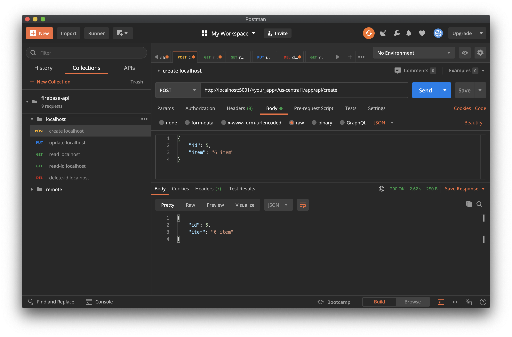
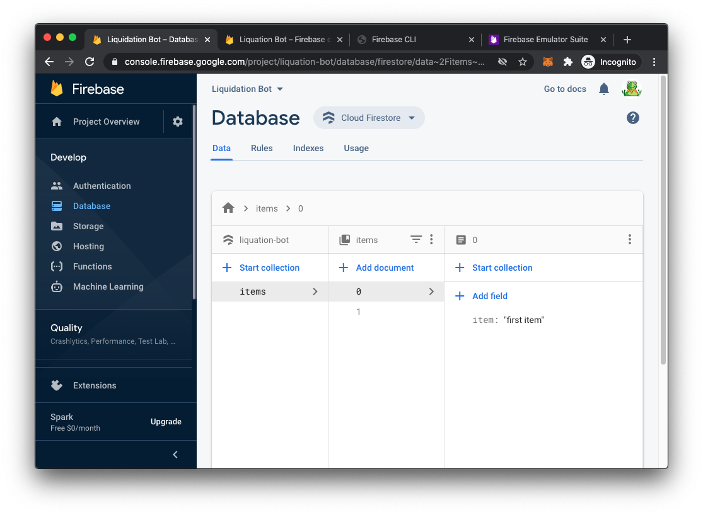

# Firestore-RESTAPI
Simple REST API with Google Cloud Firestore and Node JS 

## Pre-requirements
Firebase account
Firebase-tool
Postman
NodeJS

## Creating project in Google Firebase
### Login to Firebase Console and create new project


## Install Firebase-tool
```
$npm install -g firebase-tools
```

## Initialize Firebase Project
### Create project directory
```
$ mkdir firebase_restapi_backend
```
### Login
```
$ cd firebase_restapi_backend
$ firebase login
```
From the termnial window, you will be redirected to Google Authentication window. To use Google Cloud Firestore, you need Google account authentication.

### Initialize project
```
$ cd firebase_restapi_backend
$ firebase init
```
#### Project Setup
```
? Please select an option: Use an existing project
? Select a default Firebase project for this directory: liq-bot (Liquidation Bot)
i  Using project liq-bot (Liquidation Bot)
```
#### Function Setup
A functions directory will be created in your project with a Node.js
package pre-configured. Functions can be deployed with firebase deploy.
```
? What language would you like to use to write Cloud Functions? JavaScript
? Do you want to use ESLint to catch probable bugs and enforce style? Yes
✔  Wrote functions/package.json
✔  Wrote functions/.eslintrc.json
✔  Wrote functions/index.js
✔  Wrote functions/.gitignore
? Do you want to install dependencies with npm now? Yes
```

## Set Node App
### Install Express and Cors
```
$npm i express
$npm i cors
```

### Generate & Download Private Key
Go to Firebase Console > Settings > Service Accounts > Click Generate new private key
Also, copy the Admin SDK configuration snippet code and paste in your functions > index.js


## Run Server
```
$ cd functions
$ npm run serve
```
Above will start Function Emulator.
```
  "scripts": {
    "lint": "eslint .",
    "serve": "firebase emulators:start --only functions",
    "shell": "firebase functions:shell",
    "start": "npm run shell",
    "deploy": "firebase deploy --only functions",
    "logs": "firebase functions:log"
  }
```

## Test API with Postman


## Confirm Test Data on Firestore


## Deploy Functions To Firebase
```
$ cd functions
$ npm run deploy
```

